<head>
  <meta charset="UTF-8">
  <meta name="viewport" content="width=device-width, initial-scale=1.0">
  <title>Aye Mon San | Portfolio Website</title>
  
  <!-- Font Awesome Icons -->
  <link rel="stylesheet" href="https://cdnjs.cloudflare.com/ajax/libs/font-awesome/6.4.0/css/all.min.css">
  
  <!-- Google Fonts -->
  <link href="https://fonts.googleapis.com/css2?family=Poppins:wght@400;500;600;700&display=swap" rel="stylesheet">
  
  
</head>
<body>

  

    
    <!-- NAVIGATION BAR -->
    <nav>
      

        
A

        Aye Mon San.
      

      
      <ul class="nav-links">
        <li><a href="#about" class="active">About Me</a></li>
        <li><a href="#scholarships">Scholarships</a></li>
        <li><a href="#qualifications">Qualifications</a></li>
        <li><a href="#experience">Experience</a></li>
        <li><a href="#skills">Skills</a></li>
        <li><a href="#certifications">Certifications</a></li>
        <li><a href="#portfolio">Showcase</a></li>
      </ul>

      <a href="#connect" class="btn-contact-nav">Connect</a>
    </nav>

    <!-- HERO SECTION -->
    <section class="content-section hero-layout" id="home" style="padding-top: 0;">
      

        

        <h1>I'm Aye Mon San, an English Instructor</h1>
        
English Instructor | Content Writer

        

          Passionate about creating inclusive and engaging learning environments where students can develop strong English communication skills while building cultural awareness and confidence.
        

        
        <!-- ACTION BUTTONS SECTION -->
        

          <a href="https://miayemonsan.github.io/ayemonsan.cv/" target="_blank" class="action-link action-link-outline">
            <i class="fa-solid fa-file-pdf"></i> CV / Resume
          </a>

          <a href="https://linkedin.com" target="_blank" class="action-link action-link-outline">
            <i class="fa-brands fa-linkedin"></i> LinkedIn
          </a>

          <a href="#connect" class="action-link action-link-primary">
            <i class="fa-solid fa-paper-plane"></i> Connect With Me
          </a>
        

      

      <!-- PORTRAIT FRAME -->
      

        

          

          
          

            

              <rect width=\'500\' height=\'600\' fill=\'%23EFF6FF\'/><text x=\'50%\' y=\'50%\' dominant-baseline=\'middle\' text-anchor=\'middle\' font-family=\'sans-serif\' font-size=\'24\' fill=\'%231E40AF\'>Aye Mon San</text></svg>';">
            

          

        

      

    </section>

    <!-- ABOUT ME -->
    <section class="content-section" id="about">
      <h3 class="section-headline">About Me</h3>
      

        

          

            I am a passionate English instructor with two-year experience in online teaching, tutoring, and community education. I enjoy helping learners build confidence in English through engaging, student-centered lessons while promoting intercultural understanding and lifelong learning.
          

        

        
        

          
<h4>Nationality</h4>
Myanmar

          
<h4>Age / Gender</h4>
27 / Female

          
<h4>Current Base</h4>
Chiang Mai, Thailand

          
<h4>Status</h4>
Open to Opportunities

        

      

    </section>

    <!-- NEW SCHOLARSHIPS & HONORS SECTION (BELOW ABOUT ME) -->
    <section class="content-section" id="scholarships">
      <h3 class="section-headline">Scholarships & Honors</h3>
      

        
        <!-- United Board Scholar -->
        

          Present
          <h4 class="card-headline">Current United Board Scholar</h4>
          
United Board for Christian Higher Education in Asia

          

            Awarded full competitive scholarship funding to pursue higher education academic studies and professional leadership development.
          

        

        <!-- DISP Scholar -->
        

          Former Scholar
          <h4 class="card-headline">Former DISP Scholar</h4>
          
Diversity and Inclusive Scholarship Program (DISP), USAID

          

            Selected recipient of the DISP academic scholarship program in recognition of academic dedication and leadership potential.
          

        

      

    </section>

    <!-- QUALIFICATIONS -->
    <section class="content-section" id="qualifications">
      <h3 class="section-headline">Qualifications</h3>
      

        

          2024 – Present
          <h4 class="card-headline">B.A. in English Communication Arts</h4>
          
Payap University

        

        

          2021 – 2024
          <h4 class="card-headline">Associate Degree in Mass Media & Journalism</h4>
          
Mon National College

        

        

          2018 – 2019
          <h4 class="card-headline">B.A. in English</h4>
          
Hpa-An University

        

      

    </section>

    <!-- EXPERIENCE -->
    <section class="content-section" id="experience">
      <h3 class="section-headline">Professional Experience</h3>
      

        

          2025 – 2026
          <h4 class="card-headline">General English Teacher</h4>
          
Poy English Program (Online)

          <ul class="card-bullet-list">
            <li>Delivered engaging online English lessons in a supportive learning environment.</li>
            <li>Designed interactive lessons focusing on practical communication, grammar, and pronunciation.</li>
          </ul>
        

        

          Sep 2024 – Jul 2025
          <h4 class="card-headline">Freelance English Tutor</h4>
          
Online Marketplace

          <ul class="card-bullet-list">
            <li>Delivered personalized one-on-one and small-group English lessons to diverse learners.</li>
            <li>Helped students improve speaking fluency, pronunciation, and vocabulary.</li>
          </ul>
        

        

          Jan 2025
          <h4 class="card-headline">Volunteer Teacher</h4>
          
Chiang Rai Kindergarten

          <ul class="card-bullet-list">
            <li>Supported English learning through interactive games and creative lessons.</li>
            <li>Organized educational activities to encourage active student participation.</li>
          </ul>
        

      

    </section>

    <!-- SKILLS & LANGUAGES -->
    <section class="content-section" id="skills">
      <h3 class="section-headline">Skills & Languages</h3>
      
      

        <!-- Languages Proficiency -->
        

          <h4><i class="fa-solid fa-globe" style="color: var(--primary);"></i> Language Proficiency</h4>
          
          

            
MonNative

            

          

          

            
BurmeseBilingual

            

          

          

            
EnglishC1 / Professional

            

          

          

            
ThaiConversational

            

          

        

        <!-- Instructional Skills -->
        

          <h4><i class="fa-solid fa-chalkboard-user" style="color: var(--primary);"></i> Pedagogical Expertise</h4>
          

            Classroom Management
            Lesson Planning
            Curriculum Design
            Public Speaking
            Cross-Cultural Communication
            Active Listening
            Online Teaching Tools
            Student Assessment
          

        

      

    </section>

    <!-- CERTIFICATIONS -->
    <section class="content-section" id="certifications">
      <h3 class="section-headline">Certifications</h3>
      

        

<i class="fa-solid fa-graduation-cap"></i>
 TEFL Certification

        

<i class="fa-solid fa-certificate"></i>
 English for Career Development

        

<i class="fa-solid fa-certificate"></i>
 Teaching English in Primary Education

        

<i class="fa-solid fa-certificate"></i>
 Supporting Children Learning in Primary Education

        

<i class="fa-solid fa-certificate"></i>
 Teaching English to Refugees

        

<i class="fa-solid fa-certificate"></i>
 Supporting Children's Mental Health

        

<i class="fa-solid fa-certificate"></i>
 Child Psychology Training

        

<i class="fa-solid fa-certificate"></i>
 Children Mental Health and Wellbeing

        

<i class="fa-solid fa-certificate"></i>
 English for Tourism Professionals

        

<i class="fa-solid fa-certificate"></i>
 Gender in Language Education

        

<i class="fa-solid fa-certificate"></i>
 Teaching English: How to Teach Listening

        

<i class="fa-solid fa-certificate"></i>
 Teaching English: How to Teach Pronunciation

        

<i class="fa-solid fa-certificate"></i>
 Primary Education Listening and Observing

        

<i class="fa-solid fa-certificate"></i>
 Teaching English understanding language systems

        

<i class="fa-solid fa-certificate"></i>
 Young children, the outdoors and nature

      

    </section>

    <!-- PORTFOLIO SHOWCASE -->
    <section class="content-section" id="portfolio">
      <h3 class="section-headline">Portfolio Showcase</h3>
      
Explore my teaching modules, class materials, community projects, and awards below:

      
      <!-- Filter Category Buttons -->
      

        <button class="filter-btn active" data-filter="all">All Projects</button>
        <button class="filter-btn" data-filter="teaching">Teaching & Classes</button>
        <button class="filter-btn" data-filter="volunteering">Volunteering & Projects</button>
        <button class="filter-btn" data-filter="awards">Awards & Recognitions</button>
      

      <!-- Showcase Cards Grid -->
      

        
        <!-- TEACHING & CLASSES -->
        

          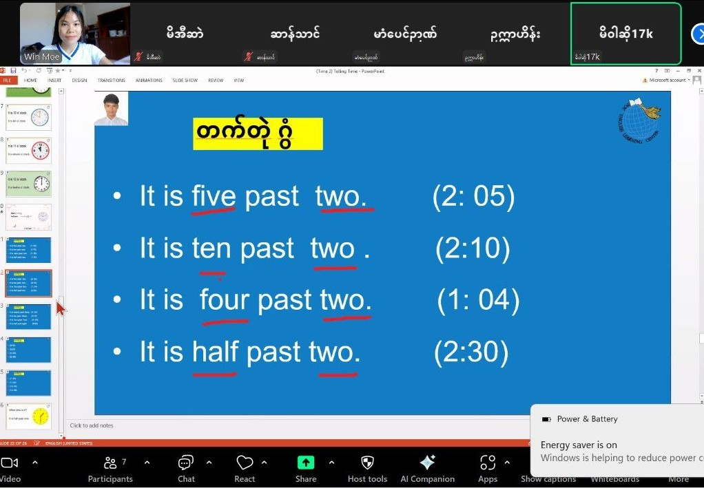<rect width=\'400\' height=\'300\' fill=\'%23EFF6FF\'/><text x=\'50%\' y=\'50%\' dominant-baseline=\'middle\' text-anchor=\'middle\' font-family=\'sans-serif\' font-size=\'16\' fill=\'%231E40AF\'>Interactive English Class</text></svg>';">
          

            <h4>Telling the time lesson</h4>
            
Teaching & Classes • Lesson Materials

          

        

        

          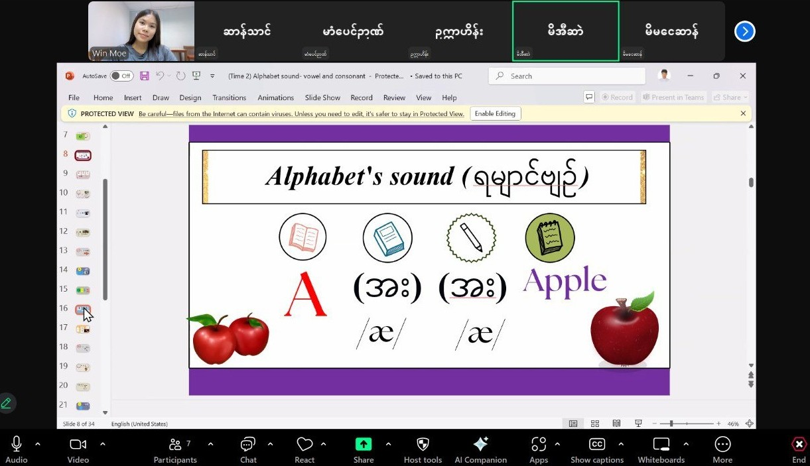<rect width=\'400\' height=\'300\' fill=\'%23EFF6FF\'/><text x=\'50%\' y=\'50%\' dominant-baseline=\'middle\' text-anchor=\'middle\' font-family=\'sans-serif\' font-size=\'16\' fill=\'%231E40AF\'>Poy English - IPA Lesson</text></svg>';">
          

            <h4>Poy English - IPA lesson</h4>
            
Teaching & Classes • Online Instruction

          

        

        

          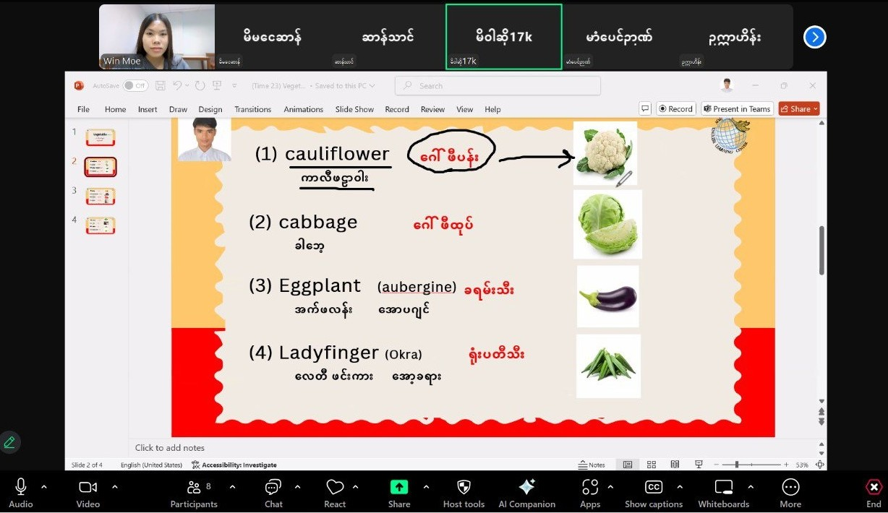<rect width=\'400\' height=\'300\' fill=\'%23EFF6FF\'/><text x=\'50%\' y=\'50%\' dominant-baseline=\'middle\' text-anchor=\'middle\' font-family=\'sans-serif\' font-size=\'16\' fill=\'%231E40AF\'>Grammar & Vocabulary</text></svg>';">
          

            <h4>Vocabulary Builder</h4>
            
Teaching & Classes • Interactive Slides

          

        

        

          <rect width=\'400\' height=\'300\' fill=\'%23EFF6FF\'/><text x=\'50%\' y=\'50%\' dominant-baseline=\'middle\' text-anchor=\'middle\' font-family=\'sans-serif\' font-size=\'16\' fill=\'%231E40AF\'>Assessment & Feedback</text></svg>';">
          

            <h4>Student Assessment</h4>
            
Teaching & Classes • Progress Evaluation

          

        

        

          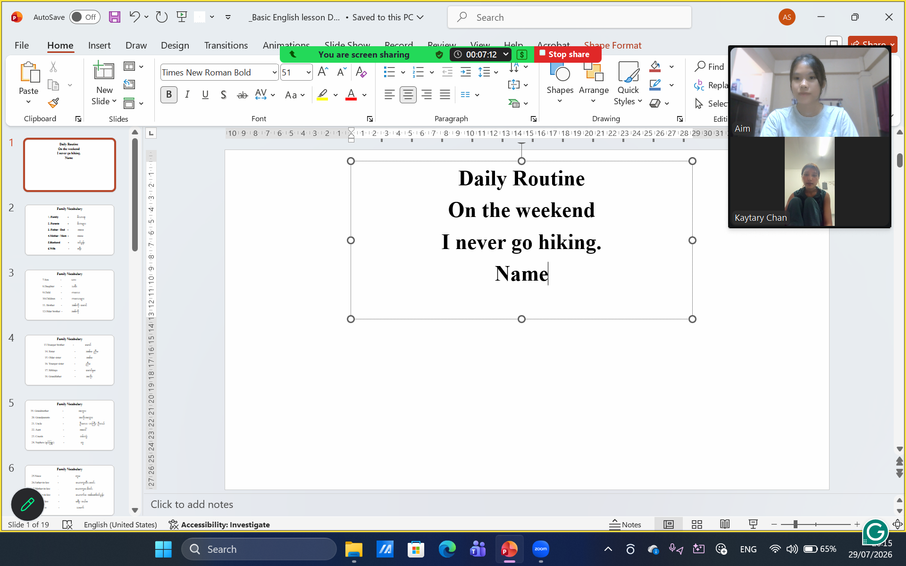<rect width=\'400\' height=\'300\' fill=\'%23EFF6FF\'/><text x=\'50%\' y=\'50%\' dominant-baseline=\'middle\' text-anchor=\'middle\' font-family=\'sans-serif\' font-size=\'16\' fill=\'%231E40AF\'>Curriculum Design</text></svg>';">
          

            <h4>Correcting students' pronunciation</h4>
            
Pronunciation practice

          

        

        <!-- VOLUNTEERING & PROJECTS -->
        

          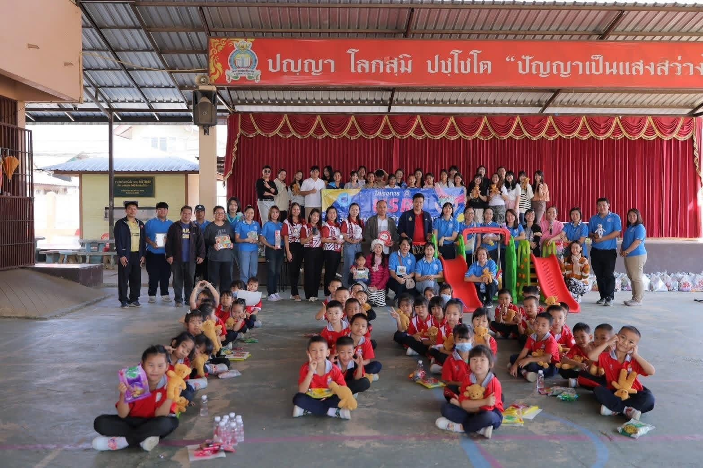<rect width=\'400\' height=\'300\' fill=\'%23EFF6FF\'/><text x=\'50%\' y=\'50%\' dominant-baseline=\'middle\' text-anchor=\'middle\' font-family=\'sans-serif\' font-size=\'16\' fill=\'%231E40AF\'>Kindergarten Volunteering</text></svg>';">
          

            <h4>Chiang Rai Kindergarten Project</h4>
            
Volunteering & Projects • Early Childhood

          

        

        

          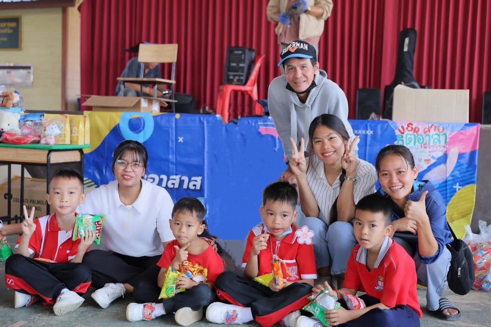<rect width=\'400\' height=\'300\' fill=\'%23EFF6FF\'/><text x=\'50%\' y=\'50%\' dominant-baseline=\'middle\' text-anchor=\'middle\' font-family=\'sans-serif\' font-size=\'16\' fill=\'%231E40AF\'>Classroom Activities</text></svg>';">
          

            <h4>Interactive Classroom Activities</h4>
            
Volunteering & Projects • Group Engagement

          

        

        

          <rect width=\'400\' height=\'300\' fill=\'%23EFF6FF\'/><text x=\'50%\' y=\'50%\' dominant-baseline=\'middle\' text-anchor=\'middle\' font-family=\'sans-serif\' font-size=\'16\' fill=\'%231E40AF\'>Community Outreach</text></svg>';">
          

            <h4>Community Outreach & Workshops</h4>
            
Volunteering & Projects • Educational Support

          

        

        

          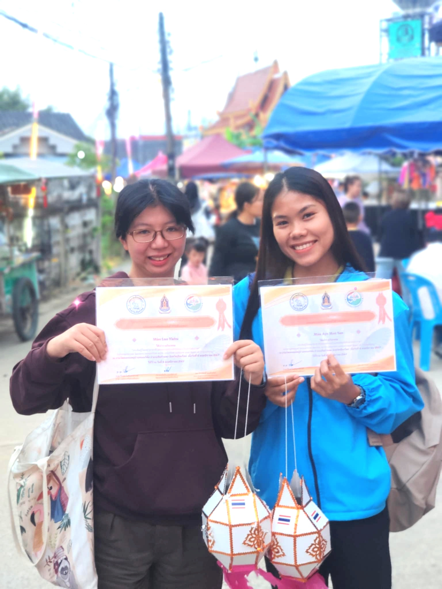<rect width=\'400\' height=\'300\' fill=\'%23EFF6FF\'/><text x=\'50%\' y=\'50%\' dominant-baseline=\'middle\' text-anchor=\'middle\' font-family=\'sans-serif\' font-size=\'16\' fill=\'%231E40AF\'>Outdoor Learning</text></svg>';">
          

            <h4>Outdoor & Experiential Learning</h4>
            
Volunteering • Cultural Activities

          

        

        

          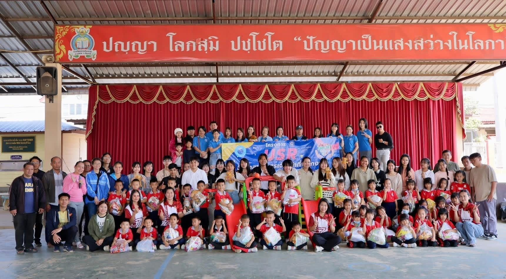<rect width=\'400\' height=\'300\' fill=\'%23EFF6FF\'/><text x=\'50%\' y=\'50%\' dominant-baseline=\'middle\' text-anchor=\'middle\' font-family=\'sans-serif\' font-size=\'16\' fill=\'%231E40AF\'>Cultural Exchange</text></svg>';">
          

            <h4>Chiang Rai Kindergarten Project</h4>
            
Volunteering & Projects • Ban San Sai School

          

        

        <!-- AWARDS & RECOGNITIONS -->
        

          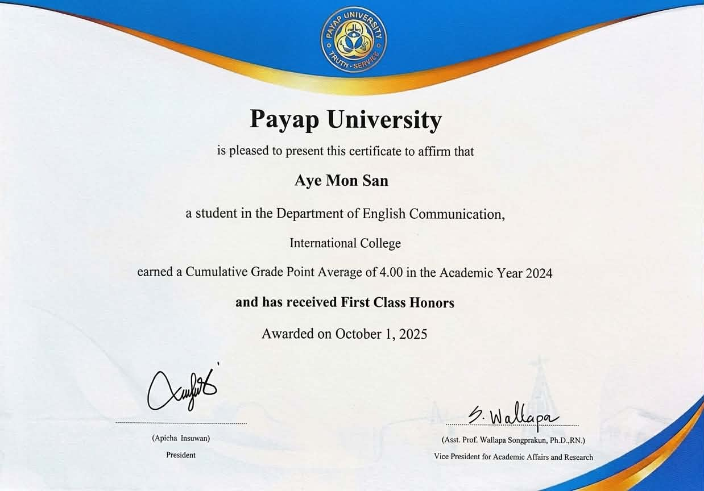<rect width=\'400\' height=\'300\' fill=\'%23EFF6FF\'/><text x=\'50%\' y=\'50%\' dominant-baseline=\'middle\' text-anchor=\'middle\' font-family=\'sans-serif\' font-size=\'16\' fill=\'%231E40AF\'>Award 1</text></svg>';">
          

            <h4>Academic Excellence Award</h4>
            
International College, Payap University

          

        

        

          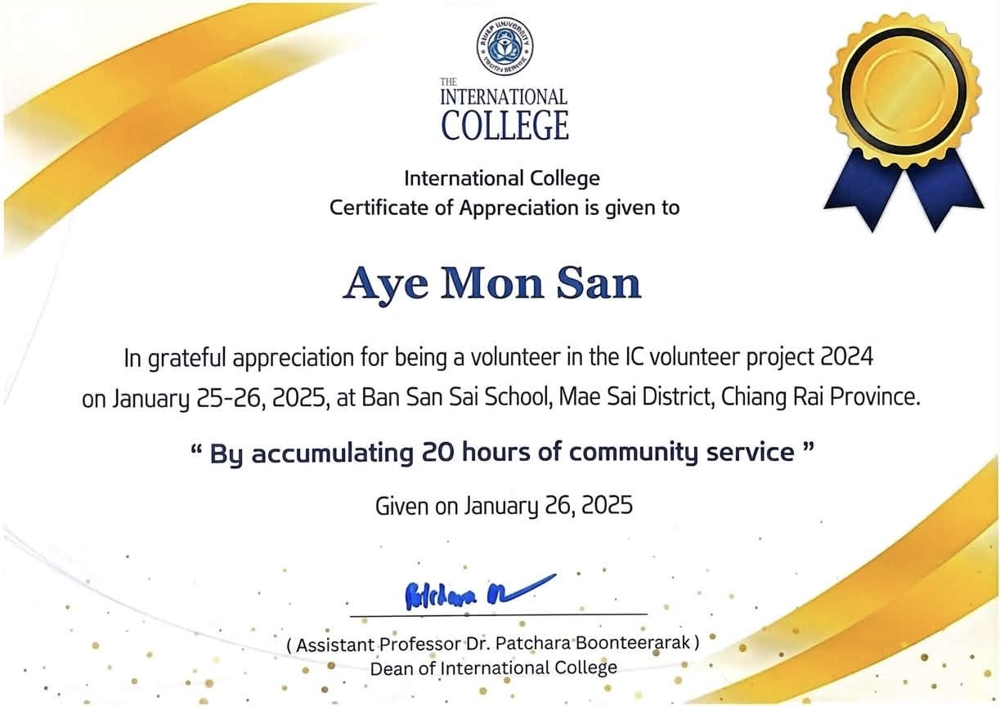<rect width=\'400\' height=\'300\' fill=\'%23EFF6FF\'/><text x=\'50%\' y=\'50%\' dominant-baseline=\'middle\' text-anchor=\'middle\' font-family=\'sans-serif\' font-size=\'16\' fill=\'%231E40AF\'>Award 2</text></svg>';">
          

            <h4>Volunteer Project Recognition</h4>
            
Ban San Sai School, Chiang Rai Province

          

        

        

          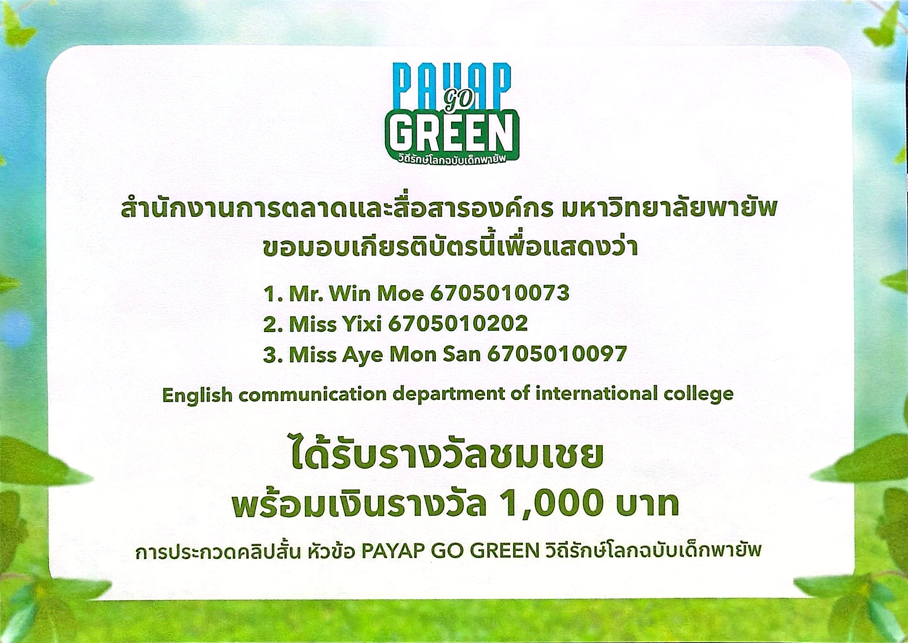<rect width=\'400\' height=\'300\' fill=\'%23EFF6FF\'/><text x=\'50%\' y=\'50%\' dominant-baseline=\'middle\' text-anchor=\'middle\' font-family=\'sans-serif\' font-size=\'16\' fill=\'%231E40AF\'>Award 3</text></svg>';">
          

            <h4>Environmental Video Competition</h4>
            
Payap University

          

        

        

          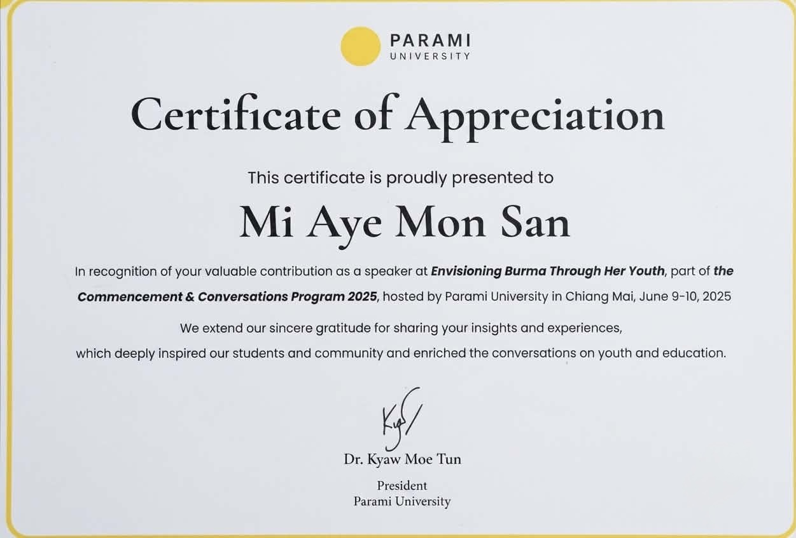<rect width=\'400\' height=\'300\' fill=\'%23EFF6FF\'/><text x=\'50%\' y=\'50%\' dominant-baseline=\'middle\' text-anchor=\'middle\' font-family=\'sans-serif\' font-size=\'16\' fill=\'%231E40AF\'>Award 4</text></svg>';">
          

            <h4>Panel Discussion Speaker</h4>
            
Parami University

          

        

        

          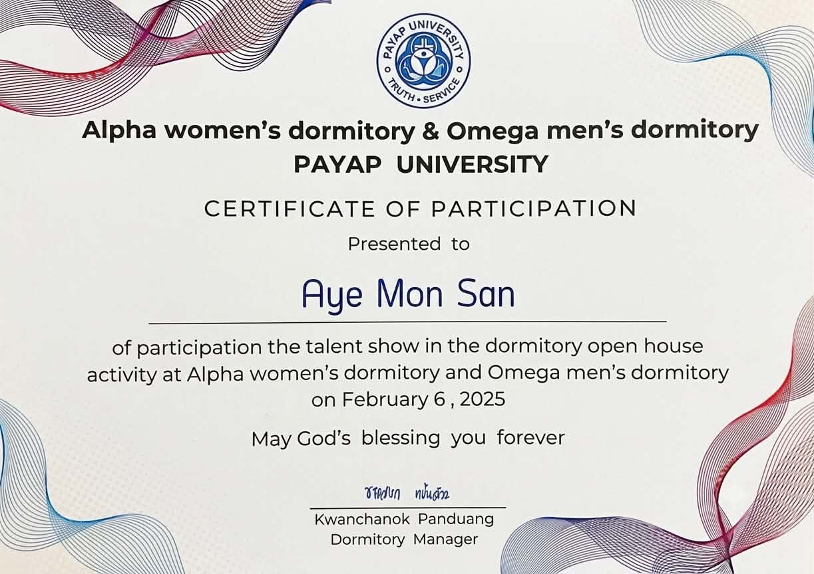<rect width=\'400\' height=\'300\' fill=\'%23EFF6FF\'/><text x=\'50%\' y=\'50%\' dominant-baseline=\'middle\' text-anchor=\'middle\' font-family=\'sans-serif\' font-size=\'16\' fill=\'%231E40AF\'>Award 6</text></svg>';">
          

            <h4>Talent Show Open House</h4>
            
Payap University

          

        

        

          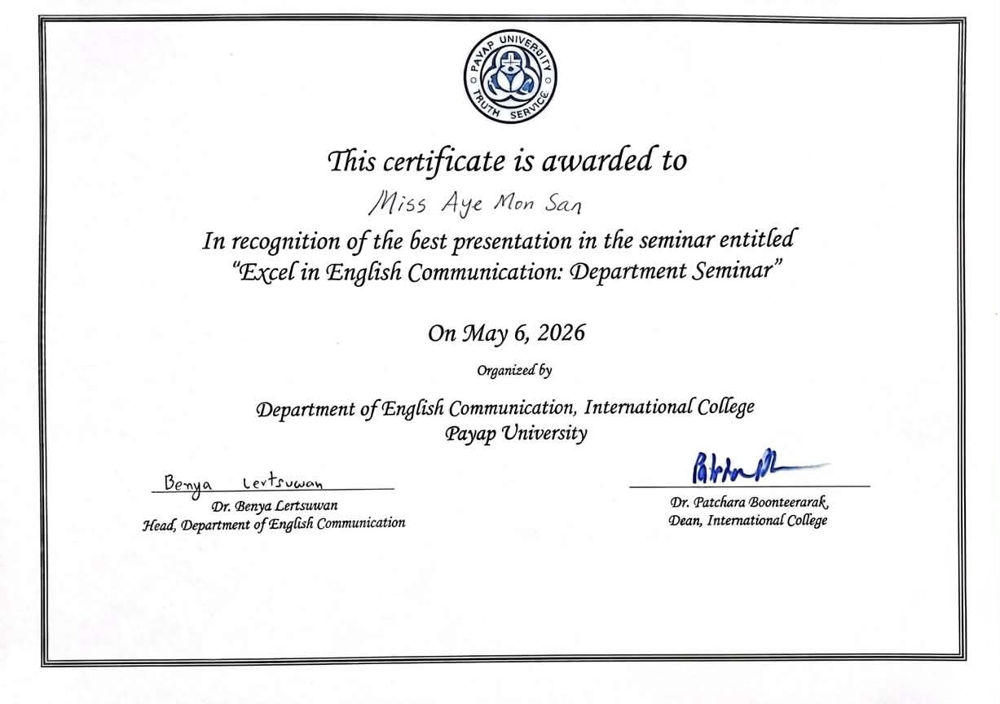<rect width=\'400\' height=\'300\' fill=\'%23EFF6FF\'/><text x=\'50%\' y=\'50%\' dominant-baseline=\'middle\' text-anchor=\'middle\' font-family=\'sans-serif\' font-size=\'16\' fill=\'%231E40AF\'>Award 7</text></svg>';">
          

            <h4>Best Presentation Award</h4>
            
Payap University Seminar

          

        

      

    </section>

    <!-- MODAL POPUPS FOR TEACHING & VOLUNTEERING -->
    

      

        &times;
        <h3 style="margin-bottom: 15px; color: var(--text-dark);">Telling the time lesson</h3>
        
        

          Designed engaging online modules focusing on practical everyday conversational English and lesson exercises.
        

      

    

    

      

        &times;
        <h3 style="margin-bottom: 15px; color: var(--text-dark);">Poy English - IPA lesson</h3>
        
        

          Delivered online instruction focused on international phonetic alphabet practices and pronunciation skills.
        

      

    

    

      

        &times;
        <h3 style="margin-bottom: 15px; color: var(--text-dark);">Vocabulary Builder</h3>
        
        

          Structured slide decks helping non-native learners expand contextual vocabulary.
        

      

    

    

      

        &times;
        <h3 style="margin-bottom: 15px; color: var(--text-dark);">Student Assessment</h3>
        
        

          Continuous evaluation frameworks tracking learner progression across key skills.
        

      

    

    

      

        &times;
        <h3 style="margin-bottom: 15px; color: var(--text-dark);">Correcting students' pronunciation</h3>
        
        

          Interactive audio-visual pronunciation guides and speech training routines.
        

      

    

    

      

        &times;
        <h3 style="margin-bottom: 15px; color: var(--text-dark);">Chiang Rai Kindergarten Project</h3>
        
        

          Volunteered in Chiang Rai assisting lead teachers in executing immersive English activities.
        

      

    

    

      

        &times;
        <h3 style="margin-bottom: 15px; color: var(--text-dark);">Interactive Classroom Activities</h3>
        
        

          Dynamic group learning activities designed to maximize engagement and language acquisition.
        

      

    

    

      

        &times;
        <h3 style="margin-bottom: 15px; color: var(--text-dark);">Community Outreach & Workshops</h3>
        
        

          Engaged in outreach initiatives providing language support to displaced young learners.
        

      

    

    

      

        &times;
        <h3 style="margin-bottom: 15px; color: var(--text-dark);">Outdoor & Experiential Learning</h3>
        
        

          Integrated experiential outdoor learning with cultural enrichment.
        

      

    

    

      

        &times;
        <h3 style="margin-bottom: 15px; color: var(--text-dark);">Chiang Rai Kindergarten Project</h3>
        
        

          Intercultural language activities conducted at Ban San Sai School.
        

      

    

    <!-- MODAL POPUPS FOR AWARDS -->
    

      

        &times;
        <h3 style="margin-bottom: 15px; color: var(--text-dark);">Academic Excellence Award</h3>
        
        

          International College, Payap University recognition for academic merit.
        

      

    

    

      

        &times;
        <h3 style="margin-bottom: 15px; color: var(--text-dark);">Volunteer Project Recognition</h3>
        
        

          Recognition for leadership in the Ban San Sai School volunteer project.
        

      

    

    

      

        &times;
        <h3 style="margin-bottom: 15px; color: var(--text-dark);">Environmental Video Competition</h3>
        
        

          Honors earned in the university-wide video competition.
        

      

    

    

      

        &times;
        <h3 style="margin-bottom: 15px; color: var(--text-dark);">Panel Discussion Speaker</h3>
        
        

          Contribution as a guest panel speaker at Parami University.
        

      

    

    

      

        &times;
        <h3 style="margin-bottom: 15px; color: var(--text-dark);">Talent Show Open House</h3>
        
        

          Award earned during the Payap University dormitory open house talent showcase.
        

      

    

    

      

        &times;
        <h3 style="margin-bottom: 15px; color: var(--text-dark);">Best Presentation Award</h3>
        
        

          Recognized for the best presentation in the Payap University seminar series.
        

      

    

    <!-- CONNECT WITH ME -->
    <section class="content-section" id="connect">
      <h3 class="section-headline">Connect with Me</h3>
      

        <a href="mailto:miayemonsan34@gmail.com" class="contact-card">
          ✉️
          <h4>Email</h4>
          
miayemonsan34@gmail.com

        </a>

        

          📍
          <h4>Location</h4>
          
Chiang Mai, Thailand

        

        

          💼
          <h4>Status</h4>
          
Available for Teaching Roles

        

      

    </section>

    <!-- FOOTER -->
    <footer>
      &copy; 2026 Aye Mon San. All rights reserved.
    </footer>

  

  <!-- JAVASCRIPT ENGINE FOR FILTERING & MODALS -->
  
